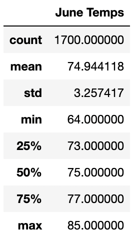
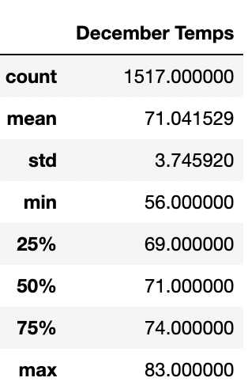

# surfs_up

## Overview
The purpose of this analysis is to provide additional data to the client for the weather statistics for the months of June and December.

## Results
* Becuase of the climate, there is very little difference between the two months of the year shown in the statistical report.
* December temperatures dip slightly colder on average, but nothing too significant, whereas in June there is little variation between the averages of the highs and lows.
* Even in December, the average max temperature is 83 degrees, to June's average max of 85 degrees.

#########################################

